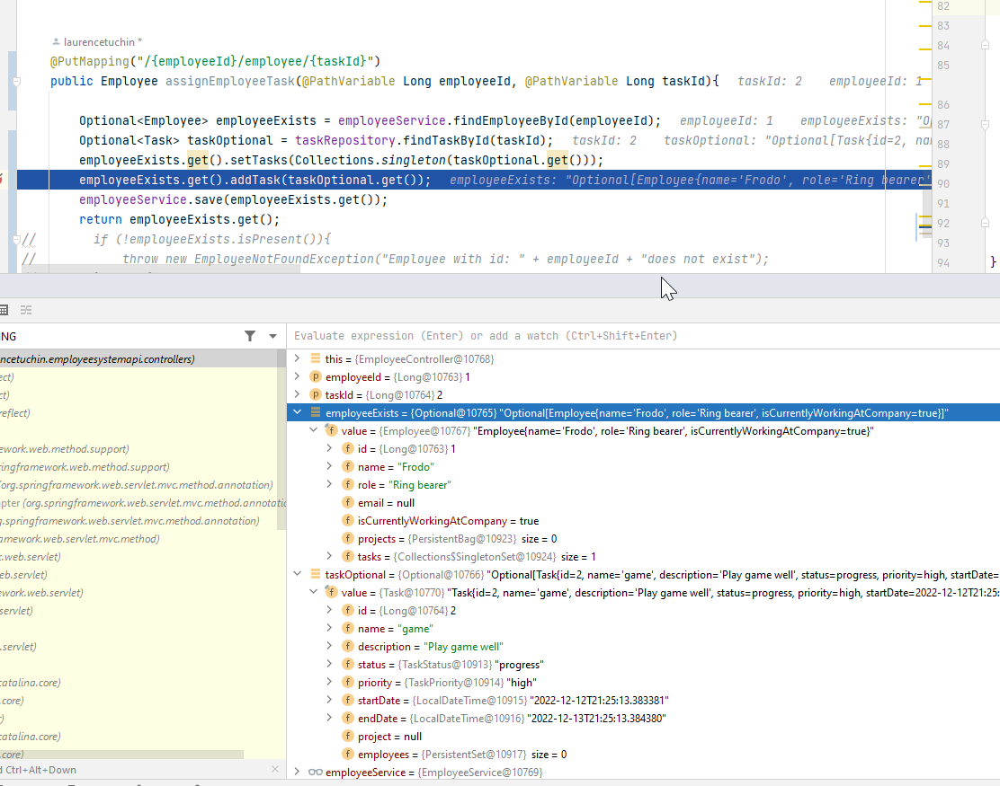

### Welcome to Employee Management System

## Efficient Management System for Organised Teams

#### Brief overview of the project, including its purpose and the problem it solves.

Our employee management system is designed to help managers keep track of important employee information and streamline team collaboration. With this system, managers can easily access and update employee profiles, track employment status, and set career goals.

Additionally, the system enables employees to create projects and assign tasks to team members, helping them stay organised and on track with their workload. By providing a central platform for managing employee information and project tasks, our system helps teams work more efficiently and effectively. It solves the problem of disorganised and fragmented communication, helping managers and employees stay informed and focused on their work.

#### List of the key features of the employee management system:

- Employee profiles: Provides a central platform for storing and updating employee information, including name, role, employment status, and career goals.
- Project and task management: Allows employees to create projects and assign tasks to team members, helping them stay organised and on track with their workload.
- Strong error handling: Features an Error Dto to help users understand why they are seeing an error and what they should do to submit correct information.
- Flexible database queries: Provides a range of options for finding information, including tasks between a range of dates, tasks associated with a specific employee or project, and tasks that are ending soon.
- Custom exceptions: Throws unique exceptions based on whether an entity does not exist or there is no association between entities found.
- CRUD capabilities: Employees can create, read, update, and delete entities for employees, projects, and tasks, as well as assign associations between these entities using the controller endpoints.
- Swagger and OpenAPI documentation: Provides a clear and concise overview of the API, including the url endpoints, accepted @PathVariables and @RequestParams, and expected HTTP responses for different status codes.

### List of the key technologies used in this project 

- Git: A version control system that allows you to track changes to your code and collaborate with other developers.
- Java 17: A programming language used to build a wide range of applications, including web, mobile, and desktop applications.
- Spring 5: A popular Java framework for building enterprise applications, including web, mobile, and desktop applications.
- Spring Boot 2: A framework that makes it easy to create stand-alone, production-grade Spring-based applications.
- Hibernate: An object-relational mapping tool for Java that simplifies the process of persisting data from Java objects to a database.
- Junit: A unit testing framework for Java that allows you to test the functionality of your code.
- Jackson: A library for parsing and generating JSON data in Java.
- Swagger v3: A tool for generating API documentation, including descriptions of the API's endpoints, parameters, and responses.
- Lombok: A library for simplifying the process of writing Java code, including features such as automatic generation of getters and setters.
- Mockito: A mocking framework for Java that allows you to write tests for code that depends on external resources.
- slf4j: A logging framework for Java that allows you to output log statements from your code.
- H2: An in-memory database that can be used for testing and prototyping.
- Postman: A tool for testing and documenting APIs.
- Docker: A containerisation platform that allows you to package and deploy applications in a portable way.
- JavaScript: A programming language used to build web applications and other software.
- React: A JavaScript library for building user interfaces, commonly used for building web applications.
- Tailwindcss: A CSS framework for building responsive and customisable user interfaces.
- Maven: A build automation tool for Java that helps you manage dependencies and build your project.
- IntelliJ: An integrated development environment (IDE) for Java and other programming languages.
- PostgreSQL: An open-source relational database management system (RDBMS) used for storing and manipulating data.

### Setup and install

To install and set up the employee management system project, you will need to follow these steps:

- Clone the project from the repository using Git.
- Make sure you have the required dependencies installed, including Java 17 and Maven.
- Navigate to the root directory of the project in your terminal and run the command mvn install. This will download and install all of the project's dependencies.
- Run the command mvn package to build the project and create a jar file.
- Run the command java -jar target/employee-management-system-0.0.1-SNAPSHOT.jar to start the application.
- The application should now be running on localhost at the default port (8081). You can access it in your web browser by navigating to http://localhost:8081. The project is configured with port 8081 in the application.properties file, to change it please update the server port in application properties. 

### A list of the dependencies used in the application: 
Version numbers are available in the pom.xml file

- spring-boot-starter-parent
- spring-boot-starter-data-jpa
- spring-boot-starter-web
- spring-boot-starter-validation
- validation-api
- hibernate-core
- spring-boot-devtools
- h2
- junit-jupiter-api
- jackson-databind
- lombok
- spring-boot-starter-test
- springdoc-openapi-ui
- spring-webflux
- testng
- annotations

### Screenshots and demos for a better understanding of how it works 

Application debugging with IntelliJ, checking the line break that an Employee object is successfully associated with a Task object. We can check the values are behaving as expected. 

### Link to demo site 

#### Api Documentation Available at [swagger link]
